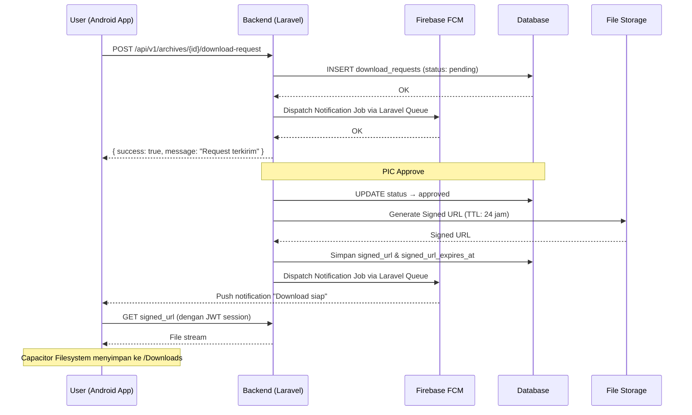

# ARSIG — PRD-02: Features & User Flow

← [Overview](PRD-01-OVERVIEW.md) | [Architecture →](PRD-03-ARCHITECTURE.md)

---

## 3. Core Features

| ID | Fitur | Deskripsi |
|---|---|---|
| F-01 | Search & Home | Halaman utama berupa search interface dengan filter keyword, PT, kategori, hashtag, tipe file, dan rentang tanggal. Menggunakan PrimeVue `InputText`, `Dropdown`, `Calendar`, dan `Chip` untuk hashtag. |
| F-02 | File Explorer | Navigasi hierarkis PT → Kategori → Sub-kategori. Tombol upload tersedia di setiap level hierarki. Menggunakan PrimeVue `Tree` atau `Breadcrumb`. |
| F-03 | Manajemen Arsip | Upload, edit, hapus arsip beserta metadata lengkap: nama, nomor file, tanggal, tipe, privacy, PIC, hashtag. Form menggunakan PrimeVue `Dialog` + `FileUpload`. |
| F-04 | Download & Request | Direct download via signed URL, atau request ke PIC dengan alur approve/reject dan notifikasi. |
| F-05 | Physical Storage Map | Visualisasi Konva.js — peta interaktif Lantai → Ruangan → Lemari → Slot untuk pelacakan hardfile. |
| F-06 | Category Management | CRUD master kategori global. Perubahan propagate otomatis ke semua PT sebagai salinan relasional. PrimeVue `TreeTable` untuk hierarki kategori. |
| F-07 | User & Auth | Login JWT, role `root`/`admin`/`user`, manajemen PIC, transfer PIC antar user. |
| F-08 | Push Notification | Native push notification Android via FCM (Firebase Cloud Messaging) + Capacitor Push plugin. |
| F-09 | Scan & Upload Foto | Akses kamera native via Capacitor Camera plugin untuk foto hardfile sebagai lampiran arsip. |
| F-10 | Download ke Folder | File tersimpan ke folder Downloads Android via Capacitor Filesystem plugin. |
| F-11 | Activity Log | Riwayat lengkap per arsip dan per user: upload, edit, hapus, download, pindah lokasi, ganti PIC. PrimeVue `DataTable` dengan pagination. |

---

## 4. User Flow

### 4.1 Alur Login (JWT)

1. User membuka app → diarahkan ke halaman login jika tidak ada access token valid di memory.
2. User submit email + password → Vue `POST /api/v1/auth/login`.
3. Laravel memvalidasi kredensial → generate access token (JWT, 15 menit) + refresh token (JWT, 7 hari).
4. Laravel mengirim access token di **response body**, refresh token di-set sebagai **httpOnly cookie**.
5. Vue menyimpan access token di memory (Pinia store) — **tidak di localStorage**.
6. Setiap request API berikutnya, Vue attach access token di `Authorization: Bearer` header.
7. Jika access token expired (401), Vue otomatis hit `/api/v1/auth/refresh` → Laravel baca refresh token dari cookie → issue access token baru.
8. Jika refresh token juga expired → user logout, redirect ke halaman login.

### 4.2 Alur Upload Arsip

1. User login dan masuk ke File Explorer.
2. User navigasi PT → Kategori → Sub-kategori (kategori otomatis terisi berdasarkan posisi).
3. User klik tombol Upload → PrimeVue `Dialog` form terbuka.
4. Untuk arsip `physical_only`: user dapat membuka kamera via Capacitor untuk foto hardfile.
5. User melengkapi field: nama, nomor file, tanggal terbit, tipe arsip, privacy, PIC, hashtag, file/foto (opsional), lokasi fisik (opsional).
6. User submit → Vue `POST /api/v1/archives` dengan `multipart/form-data`.
7. Laravel validasi (Form Request), simpan file ke storage (Laravel Filesystem), simpan metadata ke DB via Eloquent, catat log aktivitas via Observer/Event.
8. Response sukses → Vue update File Explorer tanpa full page reload.

### 4.3 Alur Download Arsip

1. User temukan arsip via Search atau File Explorer.
2. Laravel middleware validasi akses user ke arsip tersebut.
3. Jika `direct_download`: Laravel generate signed URL (TTL 60 detik) → file diunduh dan disimpan ke folder Downloads Android via Capacitor Filesystem.
4. Jika `request_to_pic`: user submit request → Laravel simpan record (status: `pending`) → PIC mendapat **push notification** native Android via Laravel Notification + FCM.
5. PIC buka halaman request → approve atau reject.
6. Jika approved: Laravel generate signed URL (TTL 24 jam) → simpan ke DB → kirim **push notification** ke requester via Laravel Queue + FCM.
7. Requester tap notifikasi → app membuka halaman download → Laravel validasi signed URL + JWT session → file diunduh ke folder Downloads.

### 4.4 Alur Push Notification (FCM)

1. Saat pertama install dan login, app request permission push notification ke Android.
2. Capacitor Push plugin generate **FCM token** untuk device.
3. App kirim FCM token ke Laravel → disimpan di tabel `user_devices`.
4. Setiap event yang butuh notifikasi, Laravel dispatch **Notification Job** ke Queue → Job kirim request ke FCM HTTP v1 API.
5. FCM deliver push notification ke device Android user.
6. User tap notifikasi → app membuka halaman yang relevan (deep link sederhana via query param).

> **Catatan Laravel:** Gunakan `php artisan queue:work` atau Laravel Horizon untuk memproses notification jobs secara async agar response API tetap cepat.
