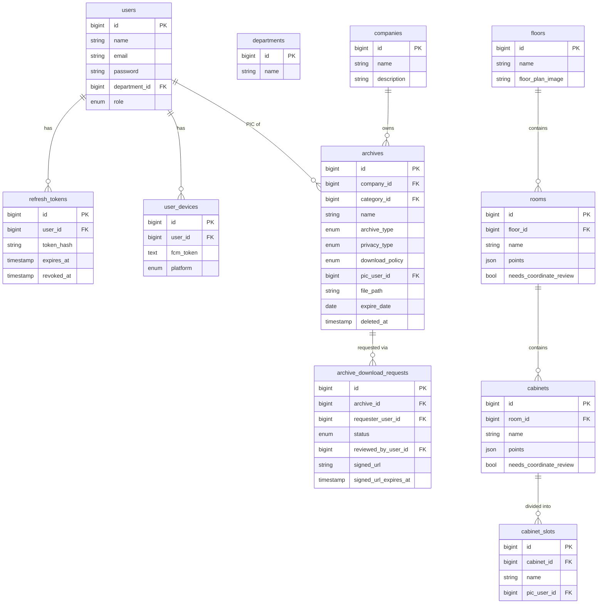

# ARSIG — PRD-04: Database Schema

← [Architecture](PRD-03-ARCHITECTURE.md) | [API Design →](PRD-05-API.md)

---

## 6. Database Schema

### 6.1 Ringkasan Tabel

| Tabel | Deskripsi |
|---|---|
| `companies` | Master data PT / entitas dalam grup |
| `departments` | Master data departemen |
| `users` | Data user dengan role `root`, `admin`, atau `user` |
| `refresh_tokens` | Penyimpanan refresh token per user (untuk revokasi) |
| `user_devices` | FCM token per device per user |
| `master_categories` | Kategori referensi global (template hierarkis) |
| `categories` | Salinan relasional kategori per PT |
| `archives` | Inti sistem — metadata, tipe arsip, privacy, download policy |
| `archive_privacy_targets` | Target akses spesifik (`user_id` atau `department_id`) |
| `archive_tags` | Hashtag untuk pencarian per arsip |
| `floors` | Data lantai + gambar denah |
| `rooms` | Ruangan di lantai (koordinat polygon Konva.js) |
| `cabinets` | Lemari di ruangan (koordinat rectangle Konva.js) |
| `cabinet_slots` | Slot dalam lemari — unit terkecil lokasi fisik |
| `archive_locations` | Relasi arsip ke lokasi fisik |
| `archive_download_requests` | Alur request, approval/rejection, dan signed URL |
| `archive_access_logs` | Log setiap akses arsip |
| `archive_activity_logs` | Log perubahan metadata arsip |
| `archive_location_logs` | Log perpindahan lokasi fisik arsip |
| `archive_pic_logs` | Log transfer kepemilikan PIC |

### 6.2 Tabel `refresh_tokens`

> Di Laravel, tabel ini dikelola manual (bukan via Sanctum) untuk mendukung revokasi per-device dan audit trail.

| Kolom | Tipe | Keterangan |
|---|---|---|
| `id` | BIGINT PK | Auto increment |
| `user_id` | BIGINT FK | Relasi ke `users.id` |
| `token_hash` | VARCHAR(255) | Hash dari refresh token (SHA-256, bukan plain text) |
| `expires_at` | TIMESTAMP | Waktu expire refresh token |
| `created_at` | TIMESTAMP | Waktu token dibuat |
| `revoked_at` | TIMESTAMP NULL | Diisi saat logout atau revokasi manual |
| `ip_address` | VARCHAR(45) | IP saat token dibuat (audit) |
| `user_agent` | TEXT NULL | Browser/device info (audit) |

### 6.3 Tabel `user_devices`

Menyimpan FCM token per device per user. Satu user bisa punya lebih dari satu device.

| Kolom | Tipe | Keterangan |
|---|---|---|
| `id` | BIGINT PK | Auto increment |
| `user_id` | BIGINT FK | Relasi ke `users.id` |
| `fcm_token` | TEXT | Token FCM dari Capacitor Push plugin |
| `device_name` | VARCHAR(255) NULL | Nama device (opsional, dari user agent) |
| `platform` | ENUM('android', 'web') | Platform device |
| `created_at` | TIMESTAMP | Waktu token didaftarkan |
| `updated_at` | TIMESTAMP | Waktu token terakhir diperbarui |

> FCM token bisa berubah — app wajib update token ke server setiap kali Capacitor mendeteksi token refresh. Gunakan `updateOrCreate` di Eloquent berdasarkan `fcm_token`.

### 6.4 Tabel `archives` (Inti)

| Kolom | Tipe | Keterangan |
|---|---|---|
| `id` | BIGINT PK | Auto increment |
| `company_id` | BIGINT FK | PT pemilik arsip |
| `category_id` | BIGINT FK | Kategori arsip |
| `name` | VARCHAR(255) | Nama dokumen |
| `file_number` | VARCHAR(100) NULL | Nomor file/dokumen |
| `archive_type` | ENUM('full', 'physical_only', 'placeholder') | Tipe arsip |
| `privacy_type` | ENUM('public', 'private', 'specific_user', 'specific_department') | Level akses |
| `download_policy` | ENUM('direct_download', 'request_to_pic') | Kebijakan download |
| `status` | ENUM('active', 'archived', 'expired') | Status arsip |
| `pic_user_id` | BIGINT FK | PIC (Person in Charge) |
| `file_path` | VARCHAR(500) NULL | Path file di storage (null untuk placeholder) |
| `issue_date` | DATE NULL | Tanggal terbit dokumen |
| `expire_date` | DATE NULL | Tanggal kadaluarsa |
| `reminder_date` | DATE NULL | Wajib diisi jika expire_date diisi |
| `created_by` | BIGINT FK | User yang mengupload |
| `created_at` | TIMESTAMP | |
| `updated_at` | TIMESTAMP | |
| `deleted_at` | TIMESTAMP NULL | Soft delete (Laravel SoftDeletes) |

### 6.5 ERD

### 6.6 Catatan Laravel Migration

- Gunakan `php artisan make:migration` untuk setiap tabel
- Gunakan `$table->softDeletes()` pada tabel `archives`
- Semua FK gunakan `constrained()->cascadeOnDelete()` atau `nullOnDelete()` sesuai kebutuhan
- Tipe `ENUM` di Laravel: `$table->enum('archive_type', ['full', 'physical_only', 'placeholder'])`
- Tipe `JSON` untuk koordinat Konva: `$table->json('points')`
